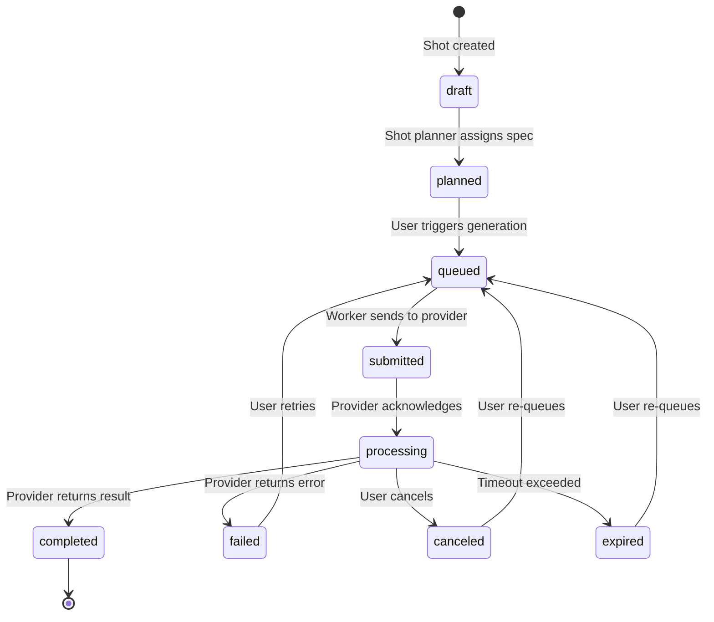
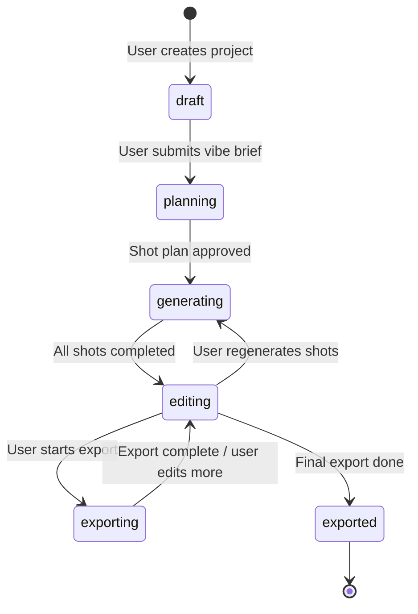
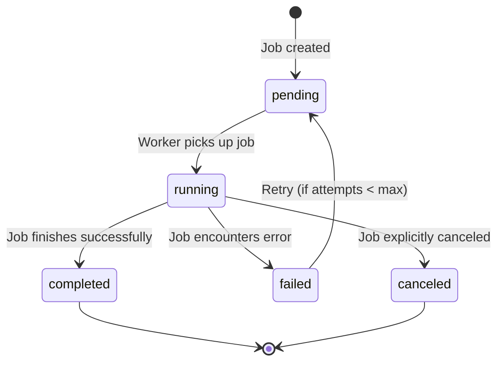
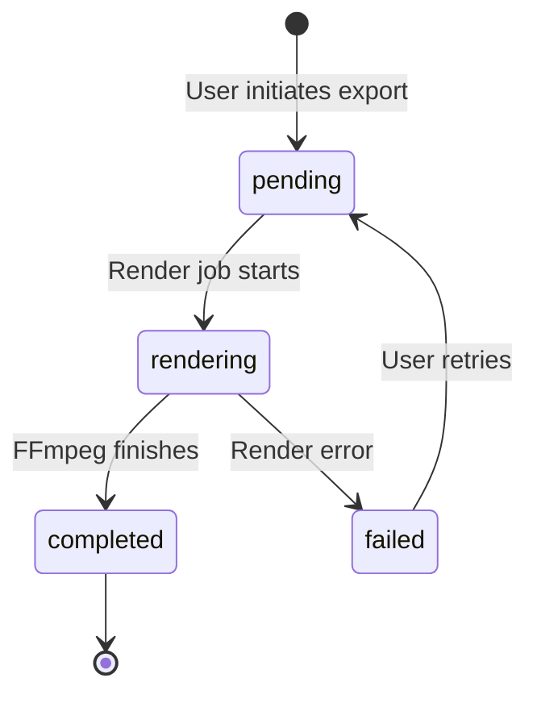

# State Machines

## 1. Generation State Machine

The core state machine governing all video generation operations.

### State Definitions

| State | Description | Transitions Out |
|-------|-------------|-----------------|
| `draft` | Shot exists but has no generation spec | → `planned` |
| `planned` | Shot planner has assigned prompt + params | → `queued` |
| `queued` | Generation job is in the internal queue | → `submitted` |
| `submitted` | Job has been sent to the provider API | → `processing` |
| `processing` | Provider is actively generating | → `completed`, `failed`, `canceled`, `expired` |
| `completed` | Generation finished successfully | Terminal |
| `failed` | Generation failed (provider error, validation) | → `queued` (retry) |
| `canceled` | User explicitly canceled | → `queued` (re-queue) |
| `expired` | Generation timed out without result | → `queued` (re-queue) |

---

## 2. Project Lifecycle

### State Definitions

| State | Description |
|-------|-------------|
| `draft` | Project created, no brief submitted |
| `planning` | AI is decomposing the brief into shots |
| `generating` | Shots are being generated by providers |
| `editing` | User is editing timeline, swapping shots |
| `exporting` | Export render is in progress |
| `exported` | At least one export completed |

---

## 3. Job Lifecycle

Generic lifecycle for all background jobs (generation, export, planning).

---

## 4. Export Lifecycle

---

## 5. Timeline Patch Operations

Not a traditional state machine, but a set of **operations** that can be applied to a timeline. Each creates a new timeline version.

| Operation | Description | Input | Effect |
|-----------|-------------|-------|--------|
| `trim` | Adjust clip start/end points | clip_id, start_ms, end_ms | Updates clip trim values |
| `replace` | Swap one clip for another | clip_id, new_asset_id | Replaces asset reference |
| `extend` | Extend a clip's duration | clip_id, extension_duration | Triggers extend generation |
| `reorder` | Change clip position | clip_id, new_index | Updates order_index values |
| `regenerate` | Generate new version of clip | clip_id, params | Creates new generation |
| `restyle` | Apply style transfer | clip_id, style_params | Creates new generation with style |
| `upscale` | Increase resolution | clip_id, target_resolution | Triggers upscale job |

Each operation:
1. Creates a new `Version` snapshot of the timeline
2. Applies the change
3. Updates the active timeline version
4. Old version remains accessible for undo
